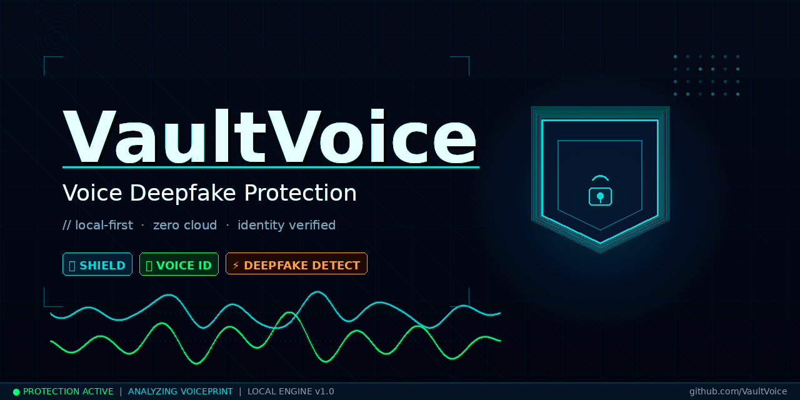

<p align="center">
  
</p>

# VaultVoice

[](https://opensource.org/licenses/MIT)
[](https://nodejs.org/)
[](https://python.org/)

**Detect AI-cloned voices. Protect your identity.** Everything runs locally — your voice data never leaves your machine.

---

## What Does It Do?

1. **Register** your voice → creates a unique voiceprint
2. **Verify** a suspicious audio → tells you if it's really you or a deepfake
3. **Scan** any audio → checks for AI-generated artifacts

No cloud. No accounts. No data collection.

---

## Installation

You need **Node.js 18+**, **Python 3.9+** and **ffmpeg**.

### Step 1 — Clone and build

```bash
git clone https://github.com/rankgnar/vaultvoice.git
cd vaultvoice
npm install
npm run build
```

### Step 2 — Install Python dependencies

**Option A: Ubuntu/Debian (without virtual environment)**

```bash
pip3 install --break-system-packages librosa numpy scipy soundfile pydub
pip3 install --break-system-packages --no-deps resemblyzer
pip3 install --break-system-packages torch --index-url https://download.pytorch.org/whl/cpu
```

**Option B: Any system (with virtual environment — recommended)**

```bash
python3 -m venv .venv
source .venv/bin/activate
pip install librosa numpy scipy soundfile pydub
pip install --no-deps resemblyzer
pip install torch --index-url https://download.pytorch.org/whl/cpu
```

> **Why 3 separate commands?** Installing everything at once downloads ~3GB of GPU libraries you don't need. This way it's ~200MB total.

> **Warnings about `webrtcvad` and `typing`?** Ignore them. VaultVoice doesn't need them.

That's it. You're ready.

---

## Usage

### Record your voice (10 seconds)

**Linux:**
```bash
arecord -d 10 -f S16_LE -r 16000 my-voice.wav
```

**macOS:**
```bash
sox -d -r 16000 -c 1 my-voice.wav trim 0 10
```

**Windows:** Use any voice recorder app, save as `.wav`.

### Register your voiceprint

```bash
node dist/cli.js register --name "my-voice" --audio my-voice.wav
```

### Verify if an audio is really you

```bash
node dist/cli.js verify --profile "my-voice" --audio suspicious-call.wav
```

Output:
```
🔍 Analyzing: suspicious-call.wav

Speaker Match:     100.0% (threshold: 85%)
Deepfake Score:    0.58 (medium risk)
Verdict:           ✅ AUTHENTIC — Likely real voice matching profile "my-voice"

Details:
  Duration:        10s
  Quality:         Good (SNR: 40dB)
  Spectral:        Natural harmonics detected
  Artifacts:       None found
```

### Scan any audio for deepfake indicators

```bash
node dist/cli.js scan --audio unknown-audio.mp3
```

### Other commands

```bash
node dist/cli.js list              # Show registered profiles
node dist/cli.js delete --name X   # Delete a profile
```

---

## How It Works

**Speaker Verification:** Extracts a 256-dimensional voiceprint using [resemblyzer](https://github.com/resemble-ai/Resemblyzer) (neural speaker encoder). Compares via cosine similarity — above 85% = match.

**Deepfake Detection:** Analyzes 5 spectral features that AI-generated audio gets wrong:

| Feature | What it catches |
|---------|----------------|
| Spectral flatness | Synthetic audio is too uniform across frames |
| Pitch consistency | Cloned voices lack natural pitch variation |
| MFCC patterns | Higher-order coefficients reveal synthesis artifacts |
| Zero-crossing rate | Natural speech has characteristic variation |
| Spectral rolloff | Vocoders produce distinctive patterns |

Score above 0.65 = likely deepfake. Everything below = clean.

---

## Supported Formats

`.wav` `.mp3` `.ogg` `.flac` `.m4a`

Non-WAV files are automatically converted to 16kHz mono WAV. Requires [ffmpeg](https://ffmpeg.org/).

---

## Privacy

- All processing is **100% local**
- Voiceprints stored in `~/.vaultvoice/voiceprints.db` (SQLite)
- **Zero network requests** — nothing is ever sent anywhere
- No telemetry, no analytics, no tracking

---

## VaultVoice vs Enterprise Solutions

| | VaultVoice | Pindrop / Nuance |
|---|---|---|
| **Price** | Free | $$$$$ |
| **Privacy** | Fully local | Cloud-based |
| **Setup** | 5 minutes | Weeks |
| **Target** | Individuals | Call centers |
| **Accuracy** | Heuristic (good for personal use) | ML-based (higher accuracy) |

---

## Use Cases

- 🔒 **Personal security** — verify voice messages from family are real
- 🎙️ **Content creators** — detect unauthorized clones of your voice
- 📰 **Journalists** — authenticate audio evidence
- 💼 **HR** — verify identity in remote interviews
- ⚖️ **Legal** — screen audio evidence for manipulation

---

## Uninstall

```bash
# Remove project
rm -rf vaultvoice

# Remove stored voiceprints
rm -rf ~/.vaultvoice

# Remove Python dependencies
pip3 uninstall resemblyzer librosa numpy scipy soundfile pydub torch -y
```

---

## Development

```bash
npm test          # Run tests (30 tests)
npm run build     # Build for production
```

---

## License

MIT
